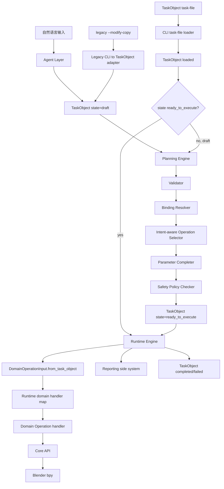
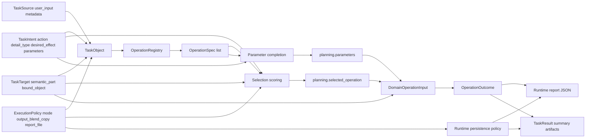

# 多 Operation 扩展开发计划书

## 0. 总结

当前系统已经完成 Step 0-22：`TaskObject` 主链、Planning、Runtime、Reporting、CLI、fake E2E、真实 Blender smoke、intent-aware operation selection 基础，以及 `edge_soften`、`weighted_normal_finish`、`solidify_thickness_preview`、`panel_line_bevel_prepare`、`armor_layer_plate_prepare`、`vent_slot_prepare`、`thruster_nozzle_prepare`、`hardpoint_socket_prepare`、`surface_inset_prepare`、`armor_edge_lip_prepare` 十个真实 modifier-only operation。原计划的 E2E/smoke 补强先暂缓，后续主线改为建设面向设计师常用动作的 operation library。详见 [Designer Operation Library 开发计划书](designer_operation_library_development_plan.md)。

多 operation 扩展的核心目标不是“多写几个 Blender 函数”，而是让系统具备可解释、可测试、可扩展的操作选择能力。新增 operation 必须继续遵守现有分层：Agent 不碰执行，Planning 只选择和补参数，Runtime 只执行 ready task，Domain 只做领域操作，Core API 才能接触 `bpy`。

本计划已经完成“多 operation 选择基础设施”和第二个真实 operation。现在默认 registry 和 Runtime context 同时支持 `edge_soften` 与 `weighted_normal_finish`，并由用户意图和 `OperationSpec` 能力契约共同决定选择。

推荐路线：

```text
Step 21: Intent-aware operation selection foundation [done]
Step 22: Add weighted_normal_finish [done]
Step DOL-1: Designer Operation Library Plan [done]
Step DOL-2: Add solidify_thickness_preview [done]
Step DOL-3: Add panel_line_bevel_prepare [done]
Step DOL-4: Add armor_layer_plate_prepare [done]
Step DOL-5: Add vent_slot_prepare [done]
Step DOL-6: Atomic Operation Extension Analysis [done]
Step DOL-7: Add thruster_nozzle_prepare [done]
Step DOL-8: Add hardpoint_socket_prepare [done]
Step AO-3: Add surface_inset_prepare [done]
Step AO-4: Add armor_edge_lip_prepare [done]
Step AO-5: Composite Pattern Candidate Table [next]
```

第一批新增 operation 建议选择 modifier-only、非破坏、低风险操作，例如 `weighted_normal_finish` 和 `solidify_thickness_preview`。暂不建议马上做布尔切割、真实 mesh apply、曲线生成或多步骤组合操作。

## 1. 架构流程图



### 设计含义

1. 多 operation 的选择发生在 Planning Layer，而不是 CLI、Runtime、Domain 或 Core。
2. Runtime 不理解自然语言，也不选择 operation；它只读取 `TaskObject.planning.selected_operation` 并分发到 handler。
3. Domain handler 不接收 operation dict，而是接收 Runtime 从 TaskObject 派生出的 `DomainOperationInput`。
4. Core API 是唯一接触 Blender `bpy` 的层。
5. Reporting 是旁支系统，只记录 Runtime 结果，不成为主链事实源。

## 2. 数据流图



### 数据原则

`TaskObject` 保存主链事实：用户意图、目标、状态、规划结果、执行摘要和 artifact 引用。它不保存完整 report，不保存 preview 大对象，也不保存低层 Blender 操作日志。

`OperationSpec` 保存 operation 能力声明：它能处理哪些 task type、需要什么状态、默认参数、参数 schema、安全级别、选择标签和 Runtime handler 名称。

`DomainOperationInput` 是 Runtime 派生出的最小领域输入：task id、operation、target object、parameters、domain-safe execution policy。它不能携带 report path、output path 或 preview/log 字段。

`OperationOutcome` 是 Domain 返回的最小结果：operation、target、success、changed objects、modifier info、mesh applied 标记和 diagnostics。

## 3. 设计原理

### 3.1 防止多事实源回潮

旧系统里存在多个相互重叠的事实源：`OperationPlan`、execution blueprint、execution package、operation dict、implementation hint。Step 18 已经把这些从真实执行路径中降级。如果新增 operation 时又从 CLI 直接构造 operation dict，或者让 Runtime 接收非 TaskObject 输入，就会重新制造双事实源。

因此多 operation 扩展必须坚持：

```text
真实执行入口只能是 TaskObject 或序列化后的 task-file。
```

### 3.2 把“选择”放在 Planning，而不是 Runtime

operation 选择依赖用户意图、目标语义、task type、安全策略和 operation 能力契约。这些都是 Planning 的职责。Runtime 的职责是执行已经规划好的任务。如果 Runtime 在执行时根据参数或自然语言再决定 handler，就会让执行层变成第二个 planner。

因此 Runtime 只能做：

```text
selected_operation -> domain_handlers[selected_operation]
```

不能做：

```text
user_input -> guess operation
parameters -> infer operation
missing handler -> choose fallback operation
```

### 3.3 用 OperationSpec 做能力契约

多 operation 不是简单函数列表，而是能力集合。每个 operation 都要声明：

```text
支持什么 task_type
要求 TaskObject 到什么 state
需要什么参数
默认参数是什么
属于什么安全级别
适合哪些 intent 标签
Runtime handler 名是什么
report 至少应包含哪些字段
```

这样 Planning 可以只依赖静态契约完成选择和参数补全，不需要 import Domain handler，也不需要碰 Blender。

### 3.4 先支持 alternative single operation，再支持 sequence

当前 `TaskPlanning` 是：

```text
selected_operation: str
parameters: dict
```

它适合“从多个 operation 里选一个”。它不适合表达“先 bevel，再 weighted normal，再 solidify”的多步骤计划。

所以路线应分两层：

1. 先支持多个候选 operation 中选择一个。
2. 等选择逻辑、handler 注册、report 结构稳定后，再引入 `operation_steps`。

过早引入 sequence 会扩大 schema、Runtime、report、failure recovery 的复杂度，不利于验证基础架构。

## 4. 当前代码基础

### 4.1 已经具备的扩展点

`OperationRegistry` 已经可以注册多个 `OperationSpec`：

```text
3d_agent/domain/operation_registry.py
```

`ParameterCompleter` 已经能从 `OperationSpec.default_parameters` 和 `task.intent.parameters` 合成参数：

```text
3d_agent/planning/parameter_completer.py
```

`ExecutionContext.domain_handlers` 已经是 operation name 到 handler 的映射：

```text
3d_agent/runtime/execution_context.py
```

Domain handler 已经统一为：

```text
handler(DomainOperationInput) -> OperationOutcome
```

### 4.2 需要先补齐的基础能力

当前 `OperationSelector` 已经可以在多个 compatible specs 中按显式 operation、`intent.action`、`intent.detail_type`、`intent.desired_effect` 和 `priority` 做选择。

当前 `OperationSpec` 已经包含 intent selection metadata。默认 registry 已经包含 `edge_soften` 和 `weighted_normal_finish`，Runtime default context 也已经注册这两个 handler。下一步的问题不是基础执行能力，也不是优先补 E2E，而是继续扩展面向真实设计动作的 operation library。

当前参数 schema 只支持 `number` 和 `string`。如果新增 operation 需要 boolean 参数，要么先用 string enum 表示，要么扩展 schema validator。

## 5. OperationSpec 目标形态

建议扩展 `OperationSpec`：

```text
name: str
supported_task_types: tuple[str, ...]
required_target_state: str
default_parameters: dict
parameter_schema: dict
safety_level: str
handler_name: str
report_schema: dict
intent_actions: tuple[str, ...]
intent_detail_types: tuple[str, ...]
intent_effects: tuple[str, ...]
priority: int
```

字段含义：

| 字段 | 作用 |
| --- | --- |
| `intent_actions` | 匹配 `task.intent.action` |
| `intent_detail_types` | 匹配 `task.intent.detail_type` |
| `intent_effects` | 匹配 `task.intent.desired_effect` |
| `priority` | 分数相同后的稳定 tie-break，数值越小优先级越高 |

这些字段只用于 Planning，不应该进入 Runtime handler 选择逻辑。

## 6. Selector 评分规则

推荐最小 scoring：

```text
score = 0
+ 100 if task.intent.parameters["operation"] == spec.name
+ 40 if task.intent.action in spec.intent_actions
+ 30 if task.intent.detail_type in spec.intent_detail_types
+ 20 if task.intent.desired_effect in spec.intent_effects
```

选择流程：

```text
1. compatible_specs = filter(task_type, required_state, safety_level)
2. scored_specs = score each compatible spec
3. reject if all scores are 0 and more than one compatible spec exists, unless a default is explicitly allowed
4. sort by (-score, priority, name)
5. select first
6. write reasoning to task.planning.reasoning
```

为什么要在 ambiguous 时失败：

如果用户只说“给胸甲做机械风格细节”，而 registry 里同时有 `edge_soften`、`weighted_normal_finish`、`solidify_thickness_preview`，系统不应该静默选第一个。多 operation 的可靠性来自可解释选择，不来自“碰巧注册顺序对了”。

## 7. 推荐新增 Operation 顺序

### 7.1 Operation 2：weighted_normal_finish

目标：增加 Weighted Normal modifier，改善硬表面模型的 shading finish，不改 mesh topology。

推荐原因：

- 非破坏。
- modifier-only。
- 和 mecha 硬表面模型高度相关。
- 比 Solidify、Boolean、Curve guide 更容易 smoke 验证。
- 可以完整验证 registry、selector、parameter completer、Runtime dispatch、Domain handler、Core helper、report。

建议 contract：

```text
name: weighted_normal_finish
task_type: surface_detail_enhancement
intent_actions: improve_shading, refine_surface
intent_detail_types: weighted_normal, shading_finish
intent_effects: hard_surface_shading_finish
safety_level: safe_non_destructive
handler_name: weighted_normal_finish
```

建议参数：

```text
keep_sharp: string enum [true, false], default true
weight: number > 0, default 50.0
modifier_name: string, default AI_WeightedNormal_Finish
```

第一版可以把 `keep_sharp` 设计成 string enum，避免马上扩展 boolean schema。后续再将 parameter schema 增加 boolean 类型。

### 7.2 Operation 3：solidify_thickness_preview

目标：增加非应用 Solidify modifier，用于装甲厚度预览。

推荐原因：

- 仍然是非破坏 modifier。
- 和打印件厚度检查相关。
- 比 weighted normal 风险更高，但仍可控。

建议 contract：

```text
name: solidify_thickness_preview
task_type: surface_detail_enhancement
intent_actions: preview_thickness, add_thickness_preview
intent_detail_types: thickness_preview, armor_thickness
intent_effects: printable_armor_thickness_preview
safety_level: safe_non_destructive
handler_name: solidify_thickness_preview
```

建议参数：

```text
thickness: number > 0, default 0.015
offset: number, default 0.0
modifier_name: string, default AI_Solidify_ThicknessPreview
```

安全策略：

- `thickness` 设置上限，例如 `<= 0.05`，直到 scale semantics 更成熟。
- 不 apply modifier。
- 不覆盖源文件。

### 7.3 Operation 4：panel_line_bevel_prepare

目标：把“边缘软化”和“分件线 bevel 准备”拆成语义不同的 operation。

推荐原因：

- 可以复用 bevel Core helper。
- 迫使 selector 区分 `edge_soften` 和 `panel_line_bevel_prepare`。
- 是向更复杂表面细节操作过渡的一步。

## 8. 分阶段开发计划

### Step 21：Intent-aware OperationSpec 与 Selector

状态：已完成。

修改文件：

```text
3d_agent/domain/operation_contracts.py
3d_agent/domain/operation_registry.py
3d_agent/planning/operation_selector.py
tests/test_operation_registry.py
tests/test_planning_operation_selector.py
```

目标：

- `OperationSpec` 支持 intent selection metadata 和 priority。
- Registry 可注册多个同 task type operation。
- Selector 根据 intent 评分选择 operation。
- ambiguous selection 有明确失败或明确默认策略。

验收：

```text
python -m unittest tests.test_operation_registry
python -m unittest tests.test_planning_operation_selector
python -m unittest discover -s tests
```

### Step 22：新增 weighted_normal_finish

状态：已完成。

修改文件：

```text
3d_agent/domain/operation_registry.py
3d_agent/blender_ops/domain_operations.py
3d_agent/core_api/geometry_api.py
3d_agent/runtime/execution_context.py
tests/test_phase_2_domain_operations.py
tests/test_runtime_execution_flow.py
tests/test_planning_engine_flow.py
```

目标：

- Registry 注册 `weighted_normal_finish`。
- Domain 实现 `weighted_normal_finish(DomainOperationInput)`。
- Core API 提供 `add_weighted_normal_modifier()`。
- Runtime default context 注册 handler。
- Planning 可按 intent 选中新 operation。

验收：

```text
python -m unittest tests.test_phase_2_domain_operations
python -m unittest tests.test_runtime_execution_flow
python -m unittest tests.test_planning_engine_flow
python -m unittest discover -s tests
```

### Step 23：Multi-operation fake E2E

新增文件：

```text
tests/test_end_to_end_multi_operation_flow.py
```

目标：

- 使用 fake classifier/parser 产生 weighted normal intent。
- Planning 选中 `weighted_normal_finish`。
- Runtime fake Domain handler 收到 `DomainOperationInput(operation="weighted_normal_finish")`。
- TaskObject completed，report 内容包含新 operation。

验收：

```text
python -m unittest tests.test_end_to_end_multi_operation_flow
python -m unittest discover -s tests
```

### Step 24：Multi-operation Blender smoke

扩展文件：

```text
scripts/run_step20_blender_smoke.py
docs/step_20_real_blender_smoke.md
```

目标：

- smoke runner 支持 `--operation edge_soften` 和 `--operation weighted_normal_finish`。
- 根据 operation 生成不同 ready task-file。
- 真实 Blender 输出 copy 和 report。
- 源 `.blend` hash 不变。

验收：

```text
python scripts\run_step20_blender_smoke.py --operation weighted_normal_finish
```

### Step 25：Operation sequence 可行性评估

目标：评估是否需要从 single selected operation 进入 multi-step operation sequence。

只有当真实需求出现以下形态时才进入 sequence：

```text
先加 Solidify preview
再加 Weighted Normal finish
再加 bevel cleanup
```

否则保持单 operation，避免过早扩展 Runtime 和 report 复杂度。

## 9. 测试策略

每一步都先跑 focused tests，再跑全量 tests。

必跑：

```text
python -m unittest tests.test_operation_registry
python -m unittest tests.test_planning_operation_selector
python -m unittest tests.test_planning_engine_flow
python -m unittest tests.test_runtime_execution_flow
python -m unittest tests.test_phase_2_domain_operations
python -m unittest discover -s tests
```

真实 Blender smoke 单独跑，不进入默认 unittest：

```text
python scripts\run_step20_blender_smoke.py --operation weighted_normal_finish
```

## 10. 风险与约束

### 10.1 Selector ambiguity

风险：多个 operation 同时支持 `surface_detail_enhancement`，但 intent 不足以区分。

应对：ambiguous 时 fail fast，要求 Agent/intent parser 输出更明确的 `action` 或 `detail_type`。

### 10.2 参数 schema 膨胀

风险：boolean、integer、bounded number、optional string 等参数类型越来越多。

应对：先支持最小需要；新增 schema 类型必须有 focused tests。

### 10.3 OperationOutcome 不够泛化

风险：未来 operation 可能创建 curve、empty、material，不只是 modifier。

应对：短期保持 modifier-only；进入对象创建前再评估 `OperationOutcome` 是否需要 `created_objects`、`materials_changed`、`collections_changed` 等字段。

### 10.4 Smoke runner 变复杂

风险：每个 operation 都需要不同 task 模板和验证逻辑。

应对：先把 smoke runner 设计成 operation profile map，而不是在 Runtime 或 Domain 加测试逻辑。

## 11. 不变量

多 operation 扩展期间，以下规则不能破：

```text
TaskObject 是真实修改主链事实源
Planning 选择 operation
Runtime 执行已选择 operation
Domain 不写文件、不写 report、不改 TaskObject
Core API 独占 bpy
CLI 不直接调用 Domain/Core
旧 OperationPlan 不恢复为执行入口
真实 Blender smoke 不进入默认单元测试
```

## 12. 立即下一步

建议下一步开始：

```text
Step AO-5: Composite Pattern 候选表
```

现在 `armor_edge_lip_prepare` 的 Registry、Planning、Runtime、Domain 和 Core 路径已经完成。下一刀应继续按照 [Atomic Operation 开发计划书](atomic_operation_development_plan.md) 整理 Composite Pattern 候选表，只列出 RG 胸甲、重甲腿、高机动背包等组合套路，不实现 sequence。
